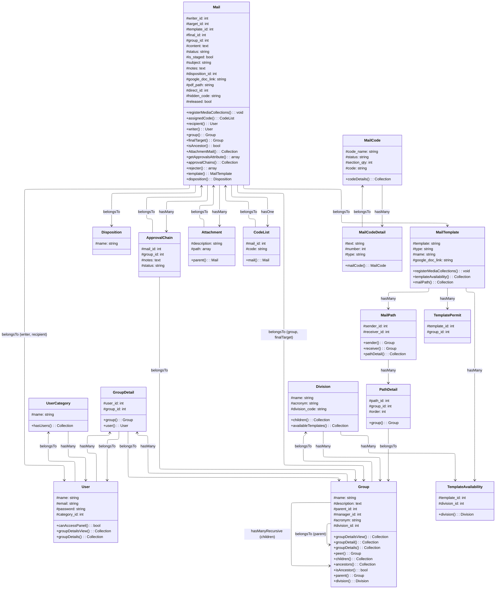

```mermaid

---
config:
  look: classic
  theme: mc
  layout: elk
---
classDiagram
class User {
    #name: string
    #email: string
    #password: string
    #category_id: int
    +canAccessPanel(): bool
    +groupDetailsView(): Collection
    +groupDetails(): Collection
}
class UserCategory {
    #name: string
    +hasUsers(): Collection
}
class Group {
    #name: string
    #description: text
    #parent_id: int
    #manager_id: int
    #acronym: string
    #division_id: int
    +groupDetailsView(): Collection
    +groupDetail(): Collection
    +groupDetails(): Collection
    +peer(): Group
    +children(): Collection
    +ancestors(): Collection
    +isAncestor(): bool
    +parent(): Group
    +division(): Division
}
class GroupDetail {
    #user_id: int
    #group_id: int
    +group(): Group
    +user(): User
}
class Division {
    #name: string
    #acronym: string
    #division_code: string
    +children(): Collection
    +availableTemplates(): Collection
}
class Disposition {
    #name: string
}
class ApprovalChain {
    #mail_id: int
    #group_id: int
    #notes: text
    #status: string
}
class Attachment {
    #description: string
    #path: array
    +parent(): Mail
}
class CodeList {
    #mail_id: int
    #code: string
    +mail(): Mail
}
class Mail {
    #writer_id: int
    #target_id: int
    #template_id: int
    #final_id: int
    #group_id: int
    #content: text
    #status: string
    #is_staged: bool
    #subject: string
    #notes: text
    #disposition_id: int
    #google_doc_link: string
    #pdf_path: string
    #direct_id: int
    #hidden_code: string
    #released: bool
    +registerMediaCollections(): void
    +assignedCode(): CodeList
    +recipient(): User
    +writer(): User
    +group(): Group
    +finalTarget(): Group
    +isAncestor(): bool
    +AttachmentMail(): Collection
    +getApprovalsAttribute(): array
    +approvalChains(): Collection
    +rejecter(): array
    +template(): MailTemplate
    +disposition(): Disposition
}
class MailCode {
    #code_name: string
    #status: string
    #section_qty: int
    #code: string
    +codeDetails(): Collection
}
class MailCodeDetail {
    #text: string
    #number: int
    #type: string
    +mailCode(): MailCode
}
class MailPath {
    #sender_id: int
    #receiver_id: int
    +sender(): Group
    +receiver(): Group
    +pathDetail(): Collection
}
class PathDetail {
    #path_id: int
    #group_id: int
    #order: int
    +group(): Group
}
class MailTemplate {
    #template: string
    #type: string
    #name: string
    #google_doc_link: string
    +registerMediaCollections(): void
    +templateAvailability(): Collection
    +mailPath(): Collection
}
class TemplateAvailability {
    #template_id: int
    #division_id: int
    +division(): Division
}
class TemplatePermit {
    #template_id: int
    #group_id: int
}
User --> UserCategory : belongsTo
UserCategory --> User : hasMany
User --> GroupDetail : hasMany
GroupDetail --> Group : belongsTo
GroupDetail --> User : belongsTo
Group --> Division : belongsTo
Group --> Group : belongsTo (parent)
Group --> Group : hasManyRecursive (children)
Group --> GroupDetail : hasMany
Division --> Group : hasMany
Division --> TemplateAvailability : hasMany
Mail --> User : belongsTo (writer, recipient)
Mail --> Group : belongsTo (group, finalTarget)
Mail --> Disposition : belongsTo
Mail --> CodeList : hasOne
Mail --> Attachment : hasMany
Mail --> ApprovalChain : hasMany
Mail --> MailTemplate : belongsTo
ApprovalChain --> Mail : belongsTo
ApprovalChain --> Group : belongsTo
Attachment --> Mail : belongsTo
CodeList --> Mail : belongsTo
MailCode --> MailCodeDetail : hasMany
MailCodeDetail --> MailCode : belongsTo
MailTemplate --> MailPath : hasMany
MailTemplate --> TemplateAvailability : hasMany
MailTemplate --> TemplatePermit : hasMany
MailPath --> PathDetail : hasMany
PathDetail --> Group : belongsTo


```