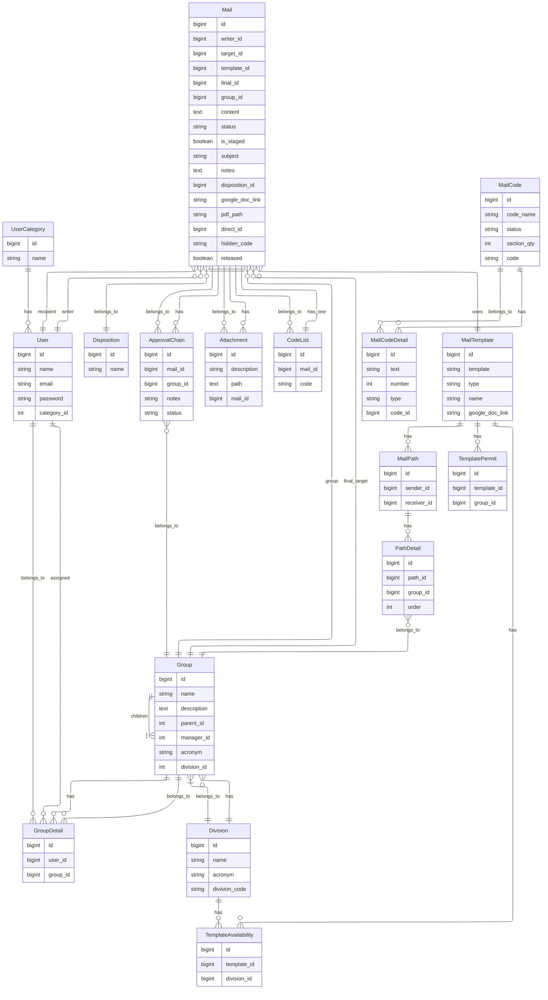

```mermaid
---
config:
  look: classic
  theme: mc
  layout: elk
---
erDiagram

    User {
        bigint id
        string name
        string email
        string password
        int category_id
    }

    UserCategory {
        bigint id
        string name
    }

    Group {
        bigint id
        string name
        text description
        int parent_id
        int manager_id
        string acronym
        int division_id
    }

    GroupDetail {
        bigint id
        bigint user_id
        bigint group_id
    }

    Division {
        bigint id
        string name
        string acronym
        string division_code
    }

    Disposition {
        bigint id
        string name
    }

    ApprovalChain {
        bigint id
        bigint mail_id
        bigint group_id
        string notes
        string status
    }

    Attachment {
        bigint id
        string description
        text path
        bigint mail_id
    }

    CodeList {
        bigint id
        bigint mail_id
        string code
    }

    Mail {
        bigint id
        bigint writer_id
        bigint target_id
        bigint template_id
        bigint final_id
        bigint group_id
        text content
        string status
        boolean is_staged
        string subject
        text notes
        bigint disposition_id
        string google_doc_link
        string pdf_path
        bigint direct_id
        string hidden_code
        boolean released
    }

    MailCode {
        bigint id
        string code_name
        string status
        int section_qty
        string code
    }

    MailCodeDetail {
        bigint id
        string text
        int number
        string type
        bigint code_id
    }

    MailPath {
        bigint id
        bigint sender_id
        bigint receiver_id
    }

    PathDetail {
        bigint id
        bigint path_id
        bigint group_id
        int order
    }

    MailTemplate {
        bigint id
        string template
        string type
        string name
        string google_doc_link
    }

    TemplateAvailability {
        bigint id
        bigint template_id
        bigint division_id
    }

    TemplatePermit {
        bigint id
        bigint template_id
        bigint group_id
    }

    UserCategory ||--o{ User : has
    User ||--o{ GroupDetail : assigned
    Group ||--o{ GroupDetail : has
    GroupDetail }o--|| Group : belongs_to
    GroupDetail }o--|| User : belongs_to

    Division ||--o{ Group : has
    Division ||--o{ TemplateAvailability : has

    Group ||--|{ Group : children
    Group }|--|| Division : belongs_to

    Mail ||--|| CodeList : has_one
    Mail ||--o{ Attachment : has
    Mail ||--o{ ApprovalChain : has
    Mail }o--|| MailTemplate : uses
    Mail }o--|| Disposition : belongs_to
    Mail }o--|| User : writer
    Mail }o--|| User : recipient
    Mail }o--|| Group : group
    Mail }o--|| Group : final_target

    ApprovalChain }o--|| Mail : belongs_to
    ApprovalChain }o--|| Group : belongs_to

    Attachment }o--|| Mail : belongs_to
    CodeList }o--|| Mail : belongs_to

    MailCode ||--o{ MailCodeDetail : has
    MailCodeDetail }o--|| MailCode : belongs_to

    MailTemplate ||--o{ MailPath : has
    MailTemplate ||--o{ TemplateAvailability : has
    MailTemplate ||--o{ TemplatePermit : has

    MailPath ||--o{ PathDetail : has
    PathDetail }o--|| Group : belongs_to


```