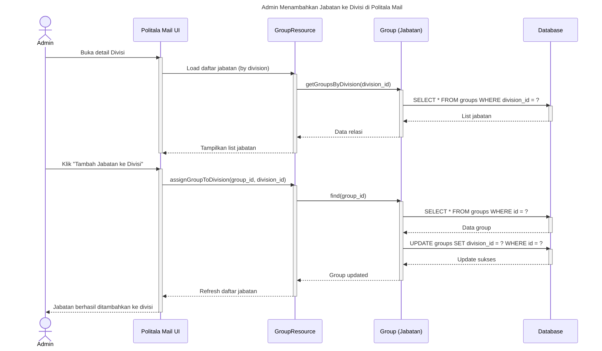

```mermaid
sequenceDiagram
    title Admin Menambahkan Jabatan ke Divisi di Politala Mail

    actor Admin
    participant FilamentUI as Politala Mail UI
    participant GroupResource
    participant GroupModel as Group (Jabatan)
    participant DB as Database

    Admin ->> FilamentUI: Buka detail Divisi
    activate FilamentUI
    FilamentUI ->> GroupResource: Load daftar jabatan (by division)
    activate GroupResource
    GroupResource ->> GroupModel: getGroupsByDivision(division_id)
    activate GroupModel
    GroupModel ->> DB: SELECT * FROM groups WHERE division_id = ?
    activate DB
    DB -->> GroupModel: List jabatan
    deactivate DB
    GroupModel -->> GroupResource: Data relasi
    deactivate GroupModel
    GroupResource -->> FilamentUI: Tampilkan list jabatan
    deactivate GroupResource
    deactivate FilamentUI

    Admin ->> FilamentUI: Klik "Tambah Jabatan ke Divisi"
    activate FilamentUI
    FilamentUI ->> GroupResource: assignGroupToDivision(group_id, division_id)
    activate GroupResource
    GroupResource ->> GroupModel: find(group_id)
    activate GroupModel
    GroupModel ->> DB: SELECT * FROM groups WHERE id = ?
    activate DB
    DB -->> GroupModel: Data group
    deactivate DB
    GroupModel ->> DB: UPDATE groups SET division_id = ? WHERE id = ?
    activate DB
    DB -->> GroupModel: Update sukses
    deactivate DB
    GroupModel -->> GroupResource: Group updated
    deactivate GroupModel
    GroupResource -->> FilamentUI: Refresh daftar jabatan
    deactivate GroupResource
    FilamentUI -->> Admin: Jabatan berhasil ditambahkan ke divisi
    deactivate FilamentUI


```