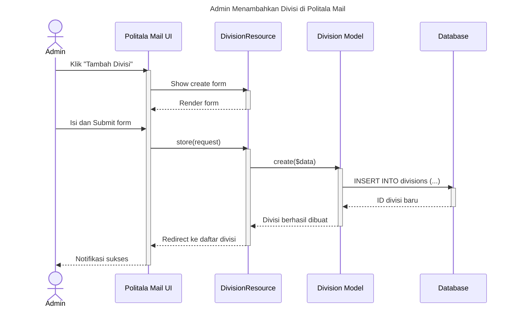

```mermaid

sequenceDiagram
    title Admin Menambahkan Divisi di Politala Mail

    actor Admin
    participant FilamentUI as Politala Mail UI
    participant DivisionResource
    participant DivisionModel as Division Model
    participant DB as Database

    Admin ->> FilamentUI: Klik "Tambah Divisi"
    activate FilamentUI
    FilamentUI ->> DivisionResource: Show create form
    activate DivisionResource
    DivisionResource -->> FilamentUI: Render form
    deactivate DivisionResource
    Admin ->> FilamentUI: Isi dan Submit form
    FilamentUI ->> DivisionResource: store(request)
    activate DivisionResource
    DivisionResource ->> DivisionModel: create($data)
    activate DivisionModel
    DivisionModel ->> DB: INSERT INTO divisions (...)
    activate DB
    DB -->> DivisionModel: ID divisi baru
    deactivate DB
    DivisionModel -->> DivisionResource: Divisi berhasil dibuat
    deactivate DivisionModel
    DivisionResource -->> FilamentUI: Redirect ke daftar divisi
    deactivate DivisionResource
    FilamentUI -->> Admin: Notifikasi sukses
    deactivate FilamentUI


```