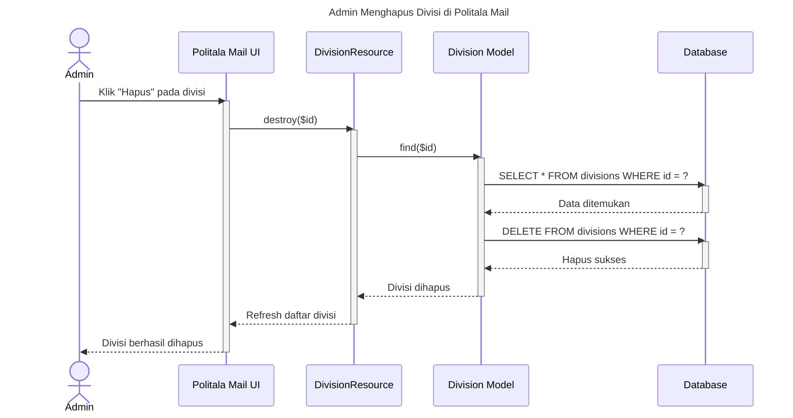

```mermaid
sequenceDiagram
    title Admin Menghapus Divisi di Politala Mail

    actor Admin
    participant FilamentUI as Politala Mail UI
    participant DivisionResource
    participant DivisionModel as Division Model
    participant DB as Database

    Admin ->> FilamentUI: Klik "Hapus" pada divisi
    activate FilamentUI
    FilamentUI ->> DivisionResource: destroy($id)
    activate DivisionResource
    DivisionResource ->> DivisionModel: find($id)
    activate DivisionModel
    DivisionModel ->> DB: SELECT * FROM divisions WHERE id = ?
    activate DB
    DB -->> DivisionModel: Data ditemukan
    deactivate DB
    DivisionModel ->> DB: DELETE FROM divisions WHERE id = ?
    activate DB
    DB -->> DivisionModel: Hapus sukses
    deactivate DB
    DivisionModel -->> DivisionResource: Divisi dihapus
    deactivate DivisionModel
    DivisionResource -->> FilamentUI: Refresh daftar divisi
    deactivate DivisionResource
    FilamentUI -->> Admin: Divisi berhasil dihapus
    deactivate FilamentUI


```