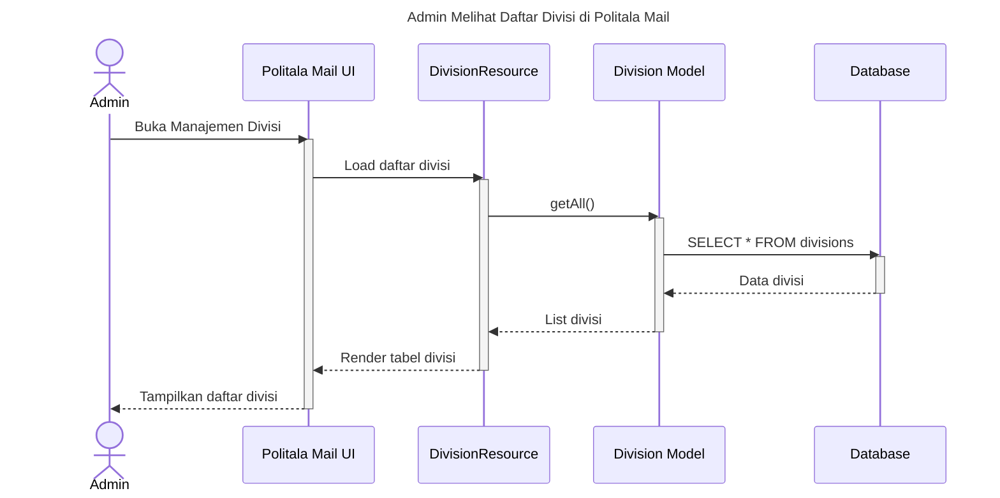

```mermaid
sequenceDiagram
    title Admin Melihat Daftar Divisi di Politala Mail

    actor Admin
    participant FilamentUI as Politala Mail UI
    participant DivisionResource
    participant DivisionModel as Division Model
    participant DB as Database

    Admin ->> FilamentUI: Buka Manajemen Divisi
    activate FilamentUI
    FilamentUI ->> DivisionResource: Load daftar divisi
    activate DivisionResource
    DivisionResource ->> DivisionModel: getAll()
    activate DivisionModel
    DivisionModel ->> DB: SELECT * FROM divisions
    activate DB
    DB -->> DivisionModel: Data divisi
    deactivate DB
    DivisionModel -->> DivisionResource: List divisi
    deactivate DivisionModel
    DivisionResource -->> FilamentUI: Render tabel divisi
    deactivate DivisionResource
    FilamentUI -->> Admin: Tampilkan daftar divisi
    deactivate FilamentUI


```