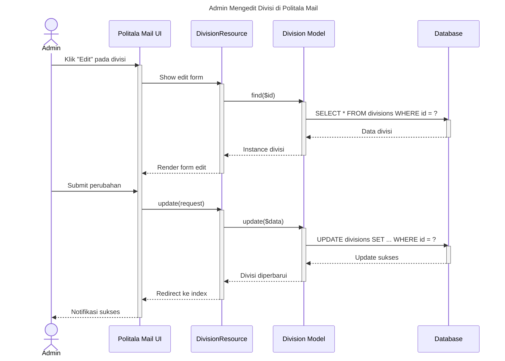

```mermaid
sequenceDiagram
    title Admin Mengedit Divisi di Politala Mail

    actor Admin
    participant FilamentUI as Politala Mail UI
    participant DivisionResource
    participant DivisionModel as Division Model
    participant DB as Database

    Admin ->> FilamentUI: Klik "Edit" pada divisi
    activate FilamentUI
    FilamentUI ->> DivisionResource: Show edit form
    activate DivisionResource
    DivisionResource ->> DivisionModel: find($id)
    activate DivisionModel
    DivisionModel ->> DB: SELECT * FROM divisions WHERE id = ?
    activate DB
    DB -->> DivisionModel: Data divisi
    deactivate DB
    DivisionModel -->> DivisionResource: Instance divisi
    deactivate DivisionModel
    DivisionResource -->> FilamentUI: Render form edit
    deactivate DivisionResource
    Admin ->> FilamentUI: Submit perubahan
    FilamentUI ->> DivisionResource: update(request)
    activate DivisionResource
    DivisionResource ->> DivisionModel: update($data)
    activate DivisionModel
    DivisionModel ->> DB: UPDATE divisions SET ... WHERE id = ?
    activate DB
    DB -->> DivisionModel: Update sukses
    deactivate DB
    DivisionModel -->> DivisionResource: Divisi diperbarui
    deactivate DivisionModel
    DivisionResource -->> FilamentUI: Redirect ke index
    deactivate DivisionResource
    FilamentUI -->> Admin: Notifikasi sukses
    deactivate FilamentUI


```