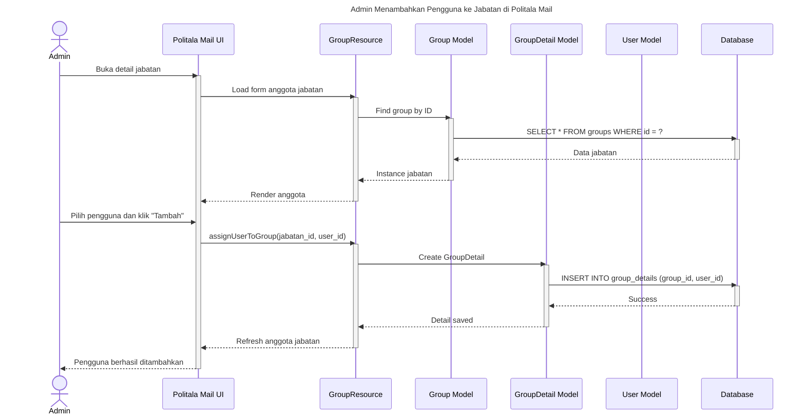

```mermaid

sequenceDiagram
    title Admin Menambahkan Pengguna ke Jabatan di Politala Mail

    actor Admin
    participant FilamentUI as Politala Mail UI
    participant GroupResource
    participant GroupModel as Group Model
    participant GroupDetailModel as GroupDetail Model
    participant UserModel as User Model
    participant DB as Database

    Admin ->> FilamentUI: Buka detail jabatan
    activate FilamentUI
    FilamentUI ->> GroupResource: Load form anggota jabatan
    activate GroupResource
    GroupResource ->> GroupModel: Find group by ID
    activate GroupModel
    GroupModel ->> DB: SELECT * FROM groups WHERE id = ?
    activate DB
    DB -->> GroupModel: Data jabatan
    deactivate DB
    GroupModel -->> GroupResource: Instance jabatan
    deactivate GroupModel
    GroupResource -->> FilamentUI: Render anggota
    deactivate GroupResource
    Admin ->> FilamentUI: Pilih pengguna dan klik "Tambah"
    FilamentUI ->> GroupResource: assignUserToGroup(jabatan_id, user_id)
    activate GroupResource
    GroupResource ->> GroupDetailModel: Create GroupDetail
    activate GroupDetailModel
    GroupDetailModel ->> DB: INSERT INTO group_details (group_id, user_id)
    activate DB
    DB -->> GroupDetailModel: Success
    deactivate DB
    GroupDetailModel -->> GroupResource: Detail saved
    deactivate GroupDetailModel
    GroupResource -->> FilamentUI: Refresh anggota jabatan
    deactivate GroupResource
    FilamentUI -->> Admin: Pengguna berhasil ditambahkan
    deactivate FilamentUI


```