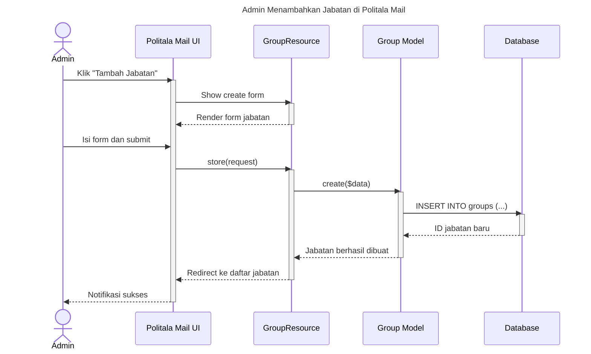

```mermaid

sequenceDiagram
    title Admin Menambahkan Jabatan di Politala Mail

    actor Admin
    participant FilamentUI as Politala Mail UI
    participant GroupResource
    participant GroupModel as Group Model
    participant DB as Database

    Admin ->> FilamentUI: Klik "Tambah Jabatan"
    activate FilamentUI
    FilamentUI ->> GroupResource: Show create form
    activate GroupResource
    GroupResource -->> FilamentUI: Render form jabatan
    deactivate GroupResource
    Admin ->> FilamentUI: Isi form dan submit
    FilamentUI ->> GroupResource: store(request)
    activate GroupResource
    GroupResource ->> GroupModel: create($data)
    activate GroupModel
    GroupModel ->> DB: INSERT INTO groups (...)
    activate DB
    DB -->> GroupModel: ID jabatan baru
    deactivate DB
    GroupModel -->> GroupResource: Jabatan berhasil dibuat
    deactivate GroupModel
    GroupResource -->> FilamentUI: Redirect ke daftar jabatan
    deactivate GroupResource
    FilamentUI -->> Admin: Notifikasi sukses
    deactivate FilamentUI


```