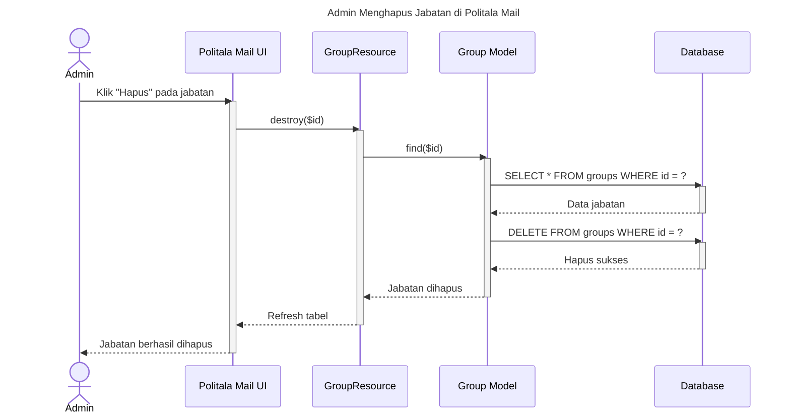

```mermaid

sequenceDiagram
    title Admin Menghapus Jabatan di Politala Mail

    actor Admin
    participant FilamentUI as Politala Mail UI
    participant GroupResource
    participant GroupModel as Group Model
    participant DB as Database

    Admin ->> FilamentUI: Klik "Hapus" pada jabatan
    activate FilamentUI
    FilamentUI ->> GroupResource: destroy($id)
    activate GroupResource
    GroupResource ->> GroupModel: find($id)
    activate GroupModel
    GroupModel ->> DB: SELECT * FROM groups WHERE id = ?
    activate DB
    DB -->> GroupModel: Data jabatan
    deactivate DB
    GroupModel ->> DB: DELETE FROM groups WHERE id = ?
    activate DB
    DB -->> GroupModel: Hapus sukses
    deactivate DB
    GroupModel -->> GroupResource: Jabatan dihapus
    deactivate GroupModel
    GroupResource -->> FilamentUI: Refresh tabel
    deactivate GroupResource
    FilamentUI -->> Admin: Jabatan berhasil dihapus
    deactivate FilamentUI


```