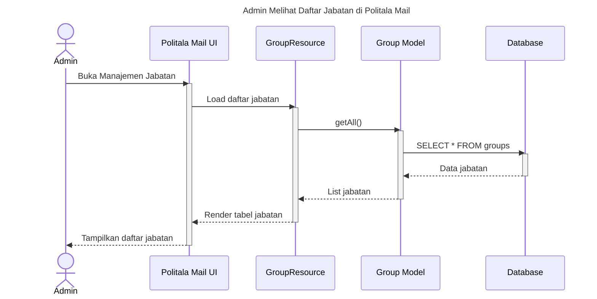

```mermaid
sequenceDiagram
    title Admin Melihat Daftar Jabatan di Politala Mail

    actor Admin
    participant FilamentUI as Politala Mail UI
    participant GroupResource
    participant GroupModel as Group Model
    participant DB as Database

    Admin ->> FilamentUI: Buka Manajemen Jabatan
    activate FilamentUI
    FilamentUI ->> GroupResource: Load daftar jabatan
    activate GroupResource
    GroupResource ->> GroupModel: getAll()
    activate GroupModel
    GroupModel ->> DB: SELECT * FROM groups
    activate DB
    DB -->> GroupModel: Data jabatan
    deactivate DB
    GroupModel -->> GroupResource: List jabatan
    deactivate GroupModel
    GroupResource -->> FilamentUI: Render tabel jabatan
    deactivate GroupResource
    FilamentUI -->> Admin: Tampilkan daftar jabatan
    deactivate FilamentUI


```