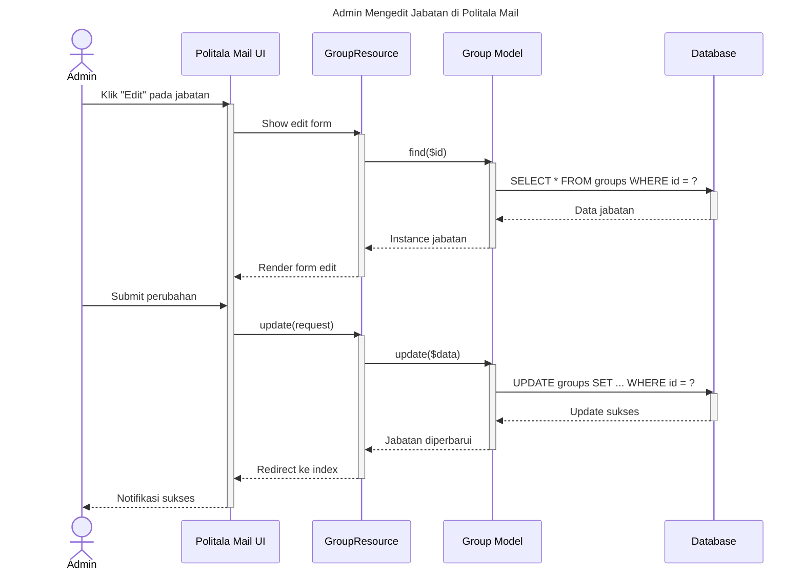

```mermaid

sequenceDiagram
    title Admin Mengedit Jabatan di Politala Mail

    actor Admin
    participant FilamentUI as Politala Mail UI
    participant GroupResource
    participant GroupModel as Group Model
    participant DB as Database

    Admin ->> FilamentUI: Klik "Edit" pada jabatan
    activate FilamentUI
    FilamentUI ->> GroupResource: Show edit form
    activate GroupResource
    GroupResource ->> GroupModel: find($id)
    activate GroupModel
    GroupModel ->> DB: SELECT * FROM groups WHERE id = ?
    activate DB
    DB -->> GroupModel: Data jabatan
    deactivate DB
    GroupModel -->> GroupResource: Instance jabatan
    deactivate GroupModel
    GroupResource -->> FilamentUI: Render form edit
    deactivate GroupResource
    Admin ->> FilamentUI: Submit perubahan
    FilamentUI ->> GroupResource: update(request)
    activate GroupResource
    GroupResource ->> GroupModel: update($data)
    activate GroupModel
    GroupModel ->> DB: UPDATE groups SET ... WHERE id = ?
    activate DB
    DB -->> GroupModel: Update sukses
    deactivate DB
    GroupModel -->> GroupResource: Jabatan diperbarui
    deactivate GroupModel
    GroupResource -->> FilamentUI: Redirect ke index
    deactivate GroupResource
    FilamentUI -->> Admin: Notifikasi sukses
    deactivate FilamentUI


```