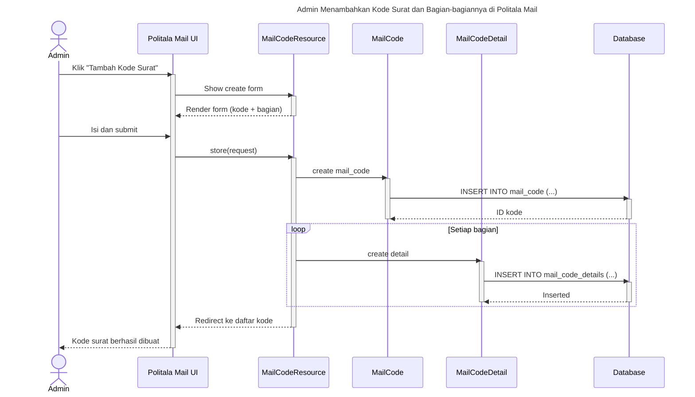

```mermaid

sequenceDiagram
    title Admin Menambahkan Kode Surat dan Bagian-bagiannya di Politala Mail

    actor Admin
    participant FilamentUI as Politala Mail UI
    participant MailCodeResource
    participant MailCodeModel as MailCode
    participant MailCodeDetailModel as MailCodeDetail
    participant DB as Database

    Admin ->> FilamentUI: Klik "Tambah Kode Surat"
    activate FilamentUI
    FilamentUI ->> MailCodeResource: Show create form
    activate MailCodeResource
    MailCodeResource -->> FilamentUI: Render form (kode + bagian)
    deactivate MailCodeResource
    Admin ->> FilamentUI: Isi dan submit
    FilamentUI ->> MailCodeResource: store(request)
    activate MailCodeResource
    MailCodeResource ->> MailCodeModel: create mail_code
    activate MailCodeModel
    MailCodeModel ->> DB: INSERT INTO mail_code (...)
    activate DB
    DB -->> MailCodeModel: ID kode
    deactivate DB
    deactivate MailCodeModel

    loop Setiap bagian
        MailCodeResource ->> MailCodeDetailModel: create detail
        activate MailCodeDetailModel
        MailCodeDetailModel ->> DB: INSERT INTO mail_code_details (...)
        activate DB
        DB -->> MailCodeDetailModel: Inserted
        deactivate DB
        deactivate MailCodeDetailModel
    end

    MailCodeResource -->> FilamentUI: Redirect ke daftar kode
    deactivate MailCodeResource
    FilamentUI -->> Admin: Kode surat berhasil dibuat
    deactivate FilamentUI


```