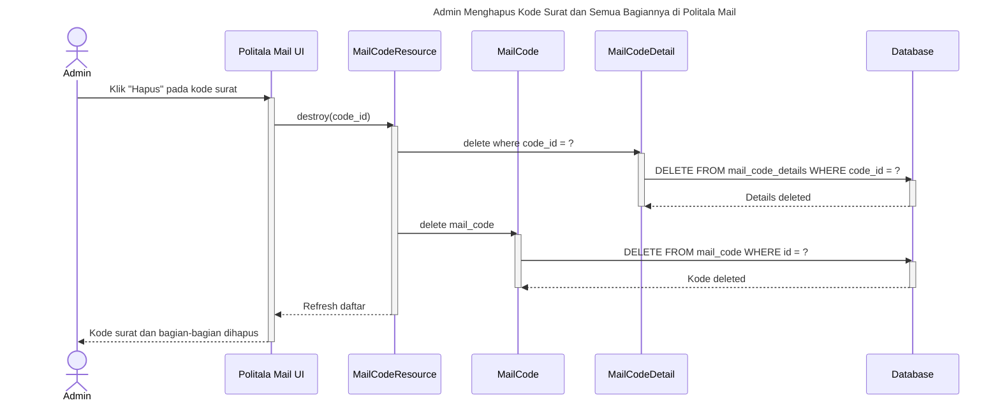

```mermaid

sequenceDiagram
    title Admin Menghapus Kode Surat dan Semua Bagiannya di Politala Mail

    actor Admin
    participant FilamentUI as Politala Mail UI
    participant MailCodeResource
    participant MailCodeModel as MailCode
    participant MailCodeDetailModel as MailCodeDetail
    participant DB as Database

    Admin ->> FilamentUI: Klik "Hapus" pada kode surat
    activate FilamentUI
    FilamentUI ->> MailCodeResource: destroy(code_id)
    activate MailCodeResource

    MailCodeResource ->> MailCodeDetailModel: delete where code_id = ?
    activate MailCodeDetailModel
    MailCodeDetailModel ->> DB: DELETE FROM mail_code_details WHERE code_id = ?
    activate DB
    DB -->> MailCodeDetailModel: Details deleted
    deactivate DB
    deactivate MailCodeDetailModel

    MailCodeResource ->> MailCodeModel: delete mail_code
    activate MailCodeModel
    MailCodeModel ->> DB: DELETE FROM mail_code WHERE id = ?
    activate DB
    DB -->> MailCodeModel: Kode deleted
    deactivate DB
    deactivate MailCodeModel

    MailCodeResource -->> FilamentUI: Refresh daftar
    deactivate MailCodeResource
    FilamentUI -->> Admin: Kode surat dan bagian-bagian dihapus
    deactivate FilamentUI


```