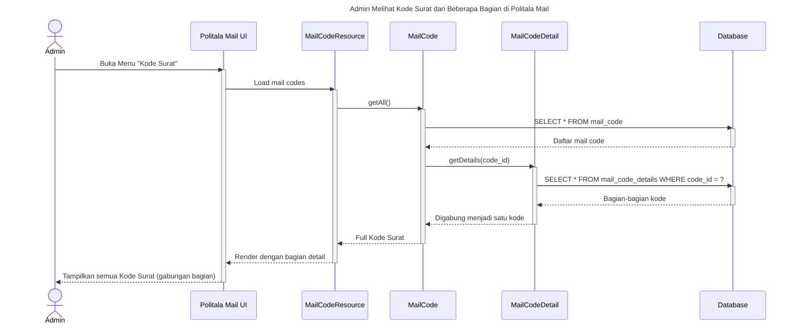

```mermaid

sequenceDiagram
    title Admin Melihat Kode Surat dari Beberapa Bagian di Politala Mail

    actor Admin
    participant FilamentUI as Politala Mail UI
    participant MailCodeResource
    participant MailCodeModel as MailCode
    participant MailCodeDetailModel as MailCodeDetail
    participant DB as Database

    Admin ->> FilamentUI: Buka Menu "Kode Surat"
    activate FilamentUI
    FilamentUI ->> MailCodeResource: Load mail codes
    activate MailCodeResource
    MailCodeResource ->> MailCodeModel: getAll()
    activate MailCodeModel
    MailCodeModel ->> DB: SELECT * FROM mail_code
    activate DB
    DB -->> MailCodeModel: Daftar mail code
    deactivate DB
    MailCodeModel ->> MailCodeDetailModel: getDetails(code_id)
    activate MailCodeDetailModel
    MailCodeDetailModel ->> DB: SELECT * FROM mail_code_details WHERE code_id = ?
    activate DB
    DB -->> MailCodeDetailModel: Bagian-bagian kode
    deactivate DB
    MailCodeDetailModel -->> MailCodeModel: Digabung menjadi satu kode
    deactivate MailCodeDetailModel
    MailCodeModel -->> MailCodeResource: Full Kode Surat
    deactivate MailCodeModel
    MailCodeResource -->> FilamentUI: Render dengan bagian detail
    deactivate MailCodeResource
    FilamentUI -->> Admin: Tampilkan semua Kode Surat (gabungan bagian)
    deactivate FilamentUI


```