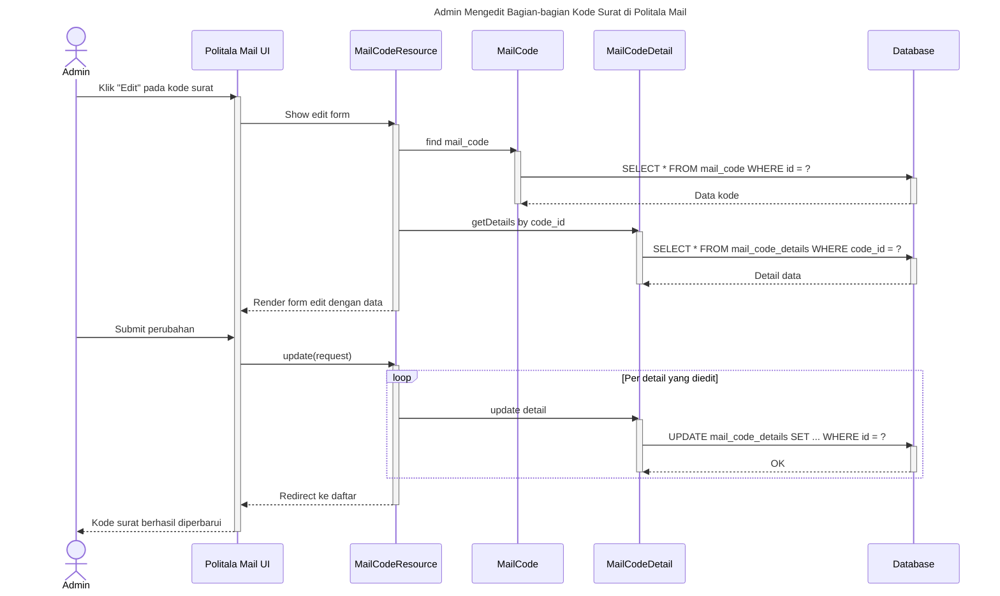

```mermaid

sequenceDiagram
    title Admin Mengedit Bagian-bagian Kode Surat di Politala Mail

    actor Admin
    participant FilamentUI as Politala Mail UI
    participant MailCodeResource
    participant MailCodeModel as MailCode
    participant MailCodeDetailModel as MailCodeDetail
    participant DB as Database

    Admin ->> FilamentUI: Klik "Edit" pada kode surat
    activate FilamentUI
    FilamentUI ->> MailCodeResource: Show edit form
    activate MailCodeResource
    MailCodeResource ->> MailCodeModel: find mail_code
    activate MailCodeModel
    MailCodeModel ->> DB: SELECT * FROM mail_code WHERE id = ?
    activate DB
    DB -->> MailCodeModel: Data kode
    deactivate DB
    deactivate MailCodeModel

    MailCodeResource ->> MailCodeDetailModel: getDetails by code_id
    activate MailCodeDetailModel
    MailCodeDetailModel ->> DB: SELECT * FROM mail_code_details WHERE code_id = ?
    activate DB
    DB -->> MailCodeDetailModel: Detail data
    deactivate DB
    deactivate MailCodeDetailModel

    MailCodeResource -->> FilamentUI: Render form edit dengan data
    deactivate MailCodeResource
    Admin ->> FilamentUI: Submit perubahan
    FilamentUI ->> MailCodeResource: update(request)
    activate MailCodeResource

    loop Per detail yang diedit
        MailCodeResource ->> MailCodeDetailModel: update detail
        activate MailCodeDetailModel
        MailCodeDetailModel ->> DB: UPDATE mail_code_details SET ... WHERE id = ?
        activate DB
        DB -->> MailCodeDetailModel: OK
        deactivate DB
        deactivate MailCodeDetailModel
    end

    MailCodeResource -->> FilamentUI: Redirect ke daftar
    deactivate MailCodeResource
    FilamentUI -->> Admin: Kode surat berhasil diperbarui
    deactivate FilamentUI


```