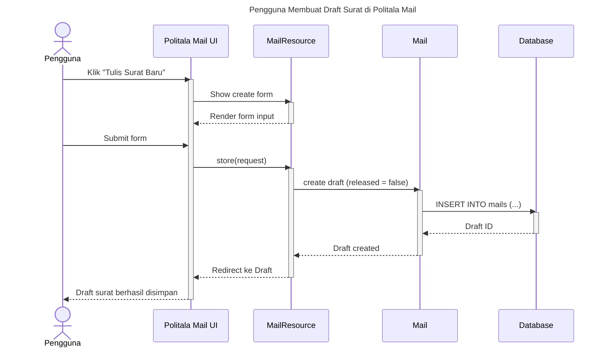

```mermaid

sequenceDiagram
    title Pengguna Membuat Draft Surat di Politala Mail

    actor Pengguna
    participant FilamentUI as Politala Mail UI
    participant MailResource
    participant MailModel as Mail
    participant DB as Database

    Pengguna ->> FilamentUI: Klik "Tulis Surat Baru"
    activate FilamentUI
    FilamentUI ->> MailResource: Show create form
    activate MailResource
    MailResource -->> FilamentUI: Render form input
    deactivate MailResource
    Pengguna ->> FilamentUI: Submit form
    FilamentUI ->> MailResource: store(request)
    activate MailResource
    MailResource ->> MailModel: create draft (released = false)
    activate MailModel
    MailModel ->> DB: INSERT INTO mails (...)
    activate DB
    DB -->> MailModel: Draft ID
    deactivate DB
    MailModel -->> MailResource: Draft created
    deactivate MailModel
    MailResource -->> FilamentUI: Redirect ke Draft
    deactivate MailResource
    FilamentUI -->> Pengguna: Draft surat berhasil disimpan
    deactivate FilamentUI


```