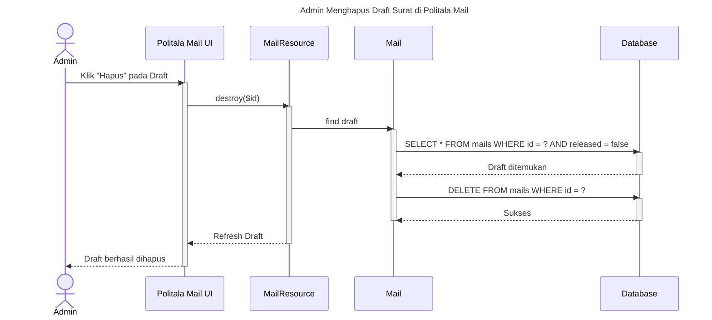

```mermaid

sequenceDiagram
    title Admin Menghapus Draft Surat di Politala Mail

    actor Admin
    participant FilamentUI as Politala Mail UI
    participant MailResource
    participant MailModel as Mail
    participant DB as Database

    Admin ->> FilamentUI: Klik "Hapus" pada Draft
    activate FilamentUI
    FilamentUI ->> MailResource: destroy($id)
    activate MailResource
    MailResource ->> MailModel: find draft
    activate MailModel
    MailModel ->> DB: SELECT * FROM mails WHERE id = ? AND released = false
    activate DB
    DB -->> MailModel: Draft ditemukan
    deactivate DB
    MailModel ->> DB: DELETE FROM mails WHERE id = ?
    activate DB
    DB -->> MailModel: Sukses
    deactivate DB
    deactivate MailModel
    MailResource -->> FilamentUI: Refresh Draft
    deactivate MailResource
    FilamentUI -->> Admin: Draft berhasil dihapus
    deactivate FilamentUI


```