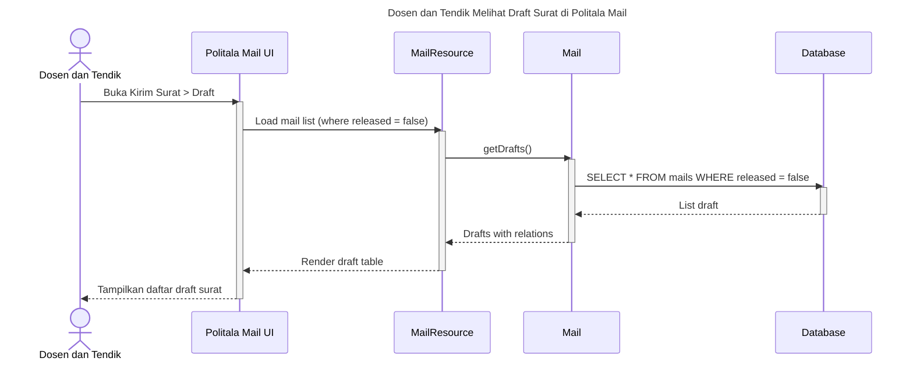

```mermaid

sequenceDiagram
    title Dosen dan Tendik Melihat Draft Surat di Politala Mail

    actor Dosen dan Tendik
    participant FilamentUI as Politala Mail UI
    participant MailResource
    participant MailModel as Mail
    participant DB as Database

    Dosen dan Tendik ->> FilamentUI: Buka Kirim Surat > Draft
    activate FilamentUI
    FilamentUI ->> MailResource: Load mail list (where released = false)
    activate MailResource
    MailResource ->> MailModel: getDrafts()
    activate MailModel
    MailModel ->> DB: SELECT * FROM mails WHERE released = false
    activate DB
    DB -->> MailModel: List draft
    deactivate DB
    MailModel -->> MailResource: Drafts with relations
    deactivate MailModel
    MailResource -->> FilamentUI: Render draft table
    deactivate MailResource
    FilamentUI -->> Dosen dan Tendik: Tampilkan daftar draft surat
    deactivate FilamentUI


```