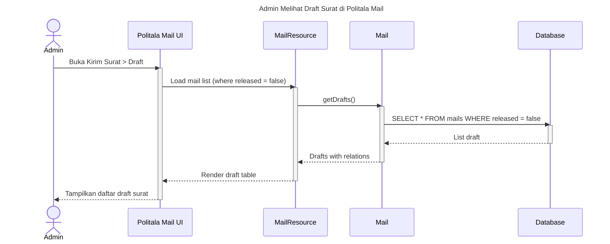

```mermaid

sequenceDiagram
    title Admin Melihat Draft Surat di Politala Mail

    actor Admin
    participant FilamentUI as Politala Mail UI
    participant MailResource
    participant MailModel as Mail
    participant DB as Database

    Admin ->> FilamentUI: Buka Kirim Surat > Draft
    activate FilamentUI
    FilamentUI ->> MailResource: Load mail list (where released = false)
    activate MailResource
    MailResource ->> MailModel: getDrafts()
    activate MailModel
    MailModel ->> DB: SELECT * FROM mails WHERE released = false
    activate DB
    DB -->> MailModel: List draft
    deactivate DB
    MailModel -->> MailResource: Drafts with relations
    deactivate MailModel
    MailResource -->> FilamentUI: Render draft table
    deactivate MailResource
    FilamentUI -->> Admin: Tampilkan daftar draft surat
    deactivate FilamentUI


```