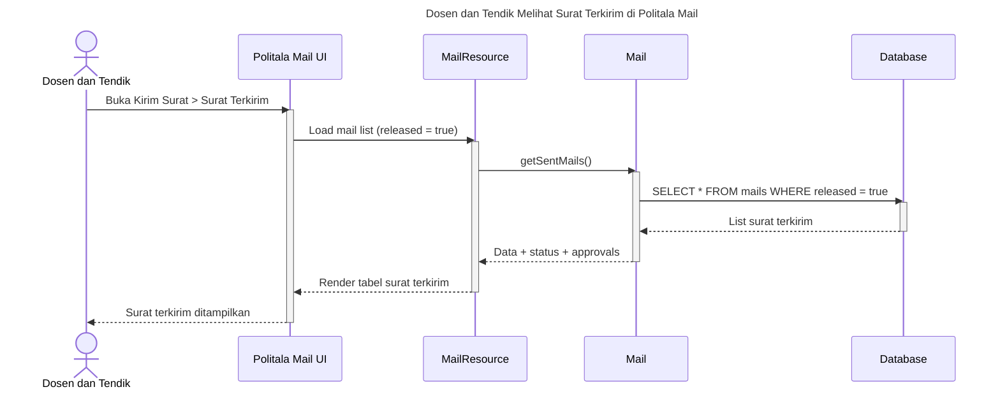

```mermaid

sequenceDiagram
    title Dosen dan Tendik Melihat Surat Terkirim di Politala Mail

    actor Dosen dan Tendik
    participant FilamentUI as Politala Mail UI
    participant MailResource
    participant MailModel as Mail
    participant DB as Database

    Dosen dan Tendik ->> FilamentUI: Buka Kirim Surat > Surat Terkirim
    activate FilamentUI
    FilamentUI ->> MailResource: Load mail list (released = true)
    activate MailResource
    MailResource ->> MailModel: getSentMails()
    activate MailModel
    MailModel ->> DB: SELECT * FROM mails WHERE released = true
    activate DB
    DB -->> MailModel: List surat terkirim
    deactivate DB
    MailModel -->> MailResource: Data + status + approvals
    deactivate MailModel
    MailResource -->> FilamentUI: Render tabel surat terkirim
    deactivate MailResource
    FilamentUI -->> Dosen dan Tendik: Surat terkirim ditampilkan
    deactivate FilamentUI


```