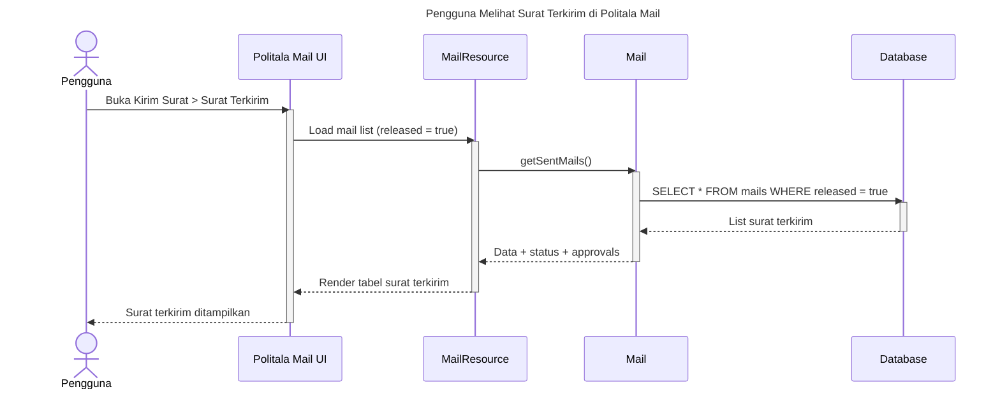

```mermaid

sequenceDiagram
    title Pengguna Melihat Surat Terkirim di Politala Mail

    actor Pengguna
    participant FilamentUI as Politala Mail UI
    participant MailResource
    participant MailModel as Mail
    participant DB as Database

    Pengguna ->> FilamentUI: Buka Kirim Surat > Surat Terkirim
    activate FilamentUI
    FilamentUI ->> MailResource: Load mail list (released = true)
    activate MailResource
    MailResource ->> MailModel: getSentMails()
    activate MailModel
    MailModel ->> DB: SELECT * FROM mails WHERE released = true
    activate DB
    DB -->> MailModel: List surat terkirim
    deactivate DB
    MailModel -->> MailResource: Data + status + approvals
    deactivate MailModel
    MailResource -->> FilamentUI: Render tabel surat terkirim
    deactivate MailResource
    FilamentUI -->> Pengguna: Surat terkirim ditampilkan
    deactivate FilamentUI


```