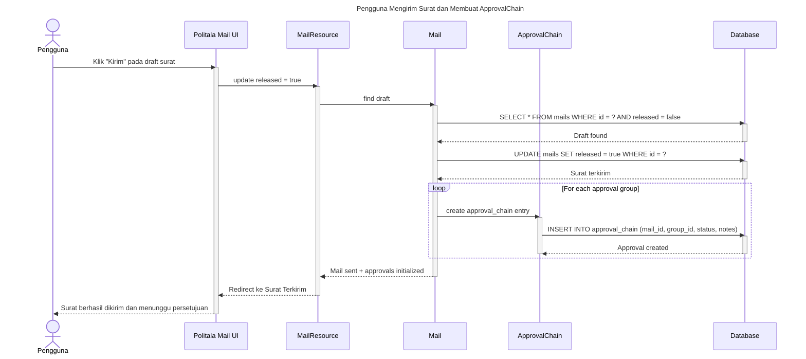

```mermaid

sequenceDiagram
    title Pengguna Mengirim Surat dan Membuat ApprovalChain

    actor Pengguna
    participant FilamentUI as Politala Mail UI
    participant MailResource
    participant MailModel as Mail
    participant ApprovalModel as ApprovalChain
    participant DB as Database

    Pengguna ->> FilamentUI: Klik "Kirim" pada draft surat
    activate FilamentUI
    FilamentUI ->> MailResource: update released = true
    activate MailResource
    MailResource ->> MailModel: find draft
    activate MailModel
    MailModel ->> DB: SELECT * FROM mails WHERE id = ? AND released = false
    activate DB
    DB -->> MailModel: Draft found
    deactivate DB

    MailModel ->> DB: UPDATE mails SET released = true WHERE id = ?
    activate DB
    DB -->> MailModel: Surat terkirim
    deactivate DB

    loop For each approval group
        MailModel ->> ApprovalModel: create approval_chain entry
        activate ApprovalModel
        ApprovalModel ->> DB: INSERT INTO approval_chain (mail_id, group_id, status, notes)
        activate DB
        DB -->> ApprovalModel: Approval created
        deactivate DB
        deactivate ApprovalModel
    end

    MailModel -->> MailResource: Mail sent + approvals initialized
    deactivate MailModel
    MailResource -->> FilamentUI: Redirect ke Surat Terkirim
    deactivate MailResource
    FilamentUI -->> Pengguna: Surat berhasil dikirim dan menunggu persetujuan
    deactivate FilamentUI


```