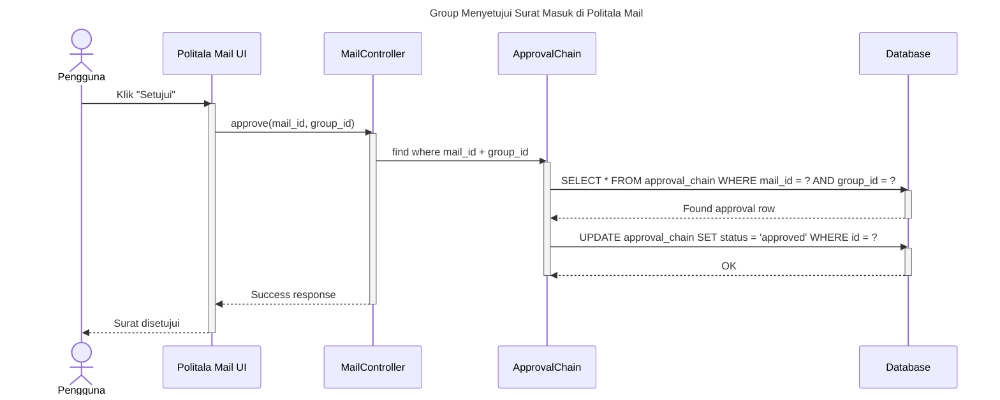

```mermaid

sequenceDiagram
    title Group Menyetujui Surat Masuk di Politala Mail

    actor Pengguna
    participant FilamentUI as Politala Mail UI
    participant MailController
    participant ApprovalModel as ApprovalChain
    participant DB as Database

    Pengguna ->> FilamentUI: Klik "Setujui"
    activate FilamentUI
    FilamentUI ->> MailController: approve(mail_id, group_id)
    activate MailController

    MailController ->> ApprovalModel: find where mail_id + group_id
    activate ApprovalModel
    ApprovalModel ->> DB: SELECT * FROM approval_chain WHERE mail_id = ? AND group_id = ?
    activate DB
    DB -->> ApprovalModel: Found approval row
    deactivate DB

    ApprovalModel ->> DB: UPDATE approval_chain SET status = 'approved' WHERE id = ?
    activate DB
    DB -->> ApprovalModel: OK
    deactivate DB
    deactivate ApprovalModel

    MailController -->> FilamentUI: Success response
    deactivate MailController
    FilamentUI -->> Pengguna: Surat disetujui
    deactivate FilamentUI


```