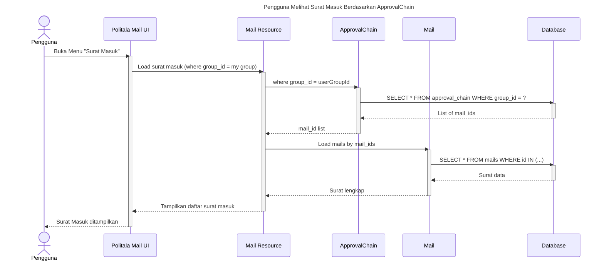

```mermaid

sequenceDiagram
    title Pengguna Melihat Surat Masuk Berdasarkan ApprovalChain

    actor Pengguna
    participant FilamentUI as Politala Mail UI
    participant MailController as Mail Resource
    participant ApprovalModel as ApprovalChain
    participant MailModel as Mail
    participant DB as Database

    Pengguna ->> FilamentUI: Buka Menu "Surat Masuk"
    activate FilamentUI
    FilamentUI ->> MailController: Load surat masuk (where group_id = my group)
    activate MailController

    MailController ->> ApprovalModel: where group_id = userGroupId
    activate ApprovalModel
    ApprovalModel ->> DB: SELECT * FROM approval_chain WHERE group_id = ?
    activate DB
    DB -->> ApprovalModel: List of mail_ids
    deactivate DB
    ApprovalModel -->> MailController: mail_id list
    deactivate ApprovalModel

    MailController ->> MailModel: Load mails by mail_ids
    activate MailModel
    MailModel ->> DB: SELECT * FROM mails WHERE id IN (...)
    activate DB
    DB -->> MailModel: Surat data
    deactivate DB
    MailModel -->> MailController: Surat lengkap
    deactivate MailModel

    MailController -->> FilamentUI: Tampilkan daftar surat masuk
    deactivate MailController
    FilamentUI -->> Pengguna: Surat Masuk ditampilkan
    deactivate FilamentUI


```