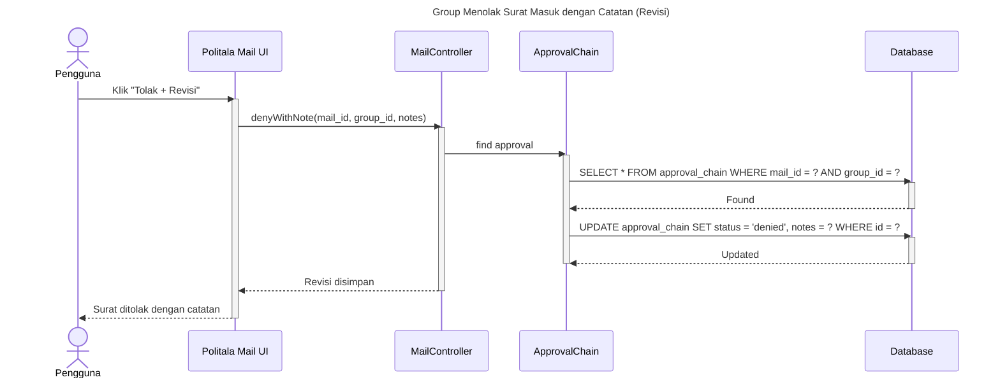

```mermaid

sequenceDiagram
    title Group Menolak Surat Masuk dengan Catatan (Revisi)

    actor Pengguna
    participant FilamentUI as Politala Mail UI
    participant MailController
    participant ApprovalModel as ApprovalChain
    participant DB as Database

    Pengguna ->> FilamentUI: Klik "Tolak + Revisi"
    activate FilamentUI
    FilamentUI ->> MailController: denyWithNote(mail_id, group_id, notes)
    activate MailController

    MailController ->> ApprovalModel: find approval
    activate ApprovalModel
    ApprovalModel ->> DB: SELECT * FROM approval_chain WHERE mail_id = ? AND group_id = ?
    activate DB
    DB -->> ApprovalModel: Found
    deactivate DB

    ApprovalModel ->> DB: UPDATE approval_chain SET status = 'denied', notes = ? WHERE id = ?
    activate DB
    DB -->> ApprovalModel: Updated
    deactivate DB
    deactivate ApprovalModel

    MailController -->> FilamentUI: Revisi disimpan
    deactivate MailController
    FilamentUI -->> Pengguna: Surat ditolak dengan catatan
    deactivate FilamentUI


```