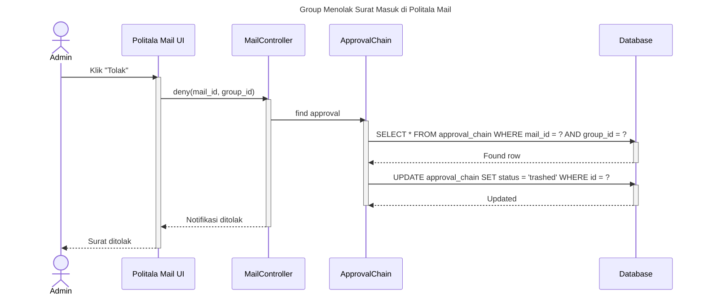

```mermaid

sequenceDiagram
    title Group Menolak Surat Masuk di Politala Mail

    actor Admin
    participant FilamentUI as Politala Mail UI
    participant MailController
    participant ApprovalModel as ApprovalChain
    participant DB as Database

    Admin ->> FilamentUI: Klik "Tolak"
    activate FilamentUI
    FilamentUI ->> MailController: deny(mail_id, group_id)
    activate MailController

    MailController ->> ApprovalModel: find approval
    activate ApprovalModel
    ApprovalModel ->> DB: SELECT * FROM approval_chain WHERE mail_id = ? AND group_id = ?
    activate DB
    DB -->> ApprovalModel: Found row
    deactivate DB

    ApprovalModel ->> DB: UPDATE approval_chain SET status = 'trashed' WHERE id = ?
    activate DB
    DB -->> ApprovalModel: Updated
    deactivate DB
    deactivate ApprovalModel

    MailController -->> FilamentUI: Notifikasi ditolak
    deactivate MailController
    FilamentUI -->> Admin: Surat ditolak
    deactivate FilamentUI


```