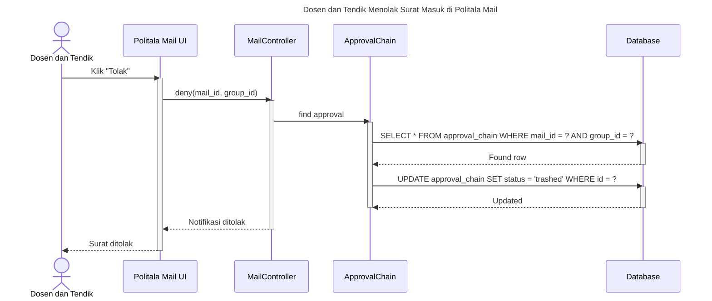

```mermaid

sequenceDiagram
    title Dosen dan Tendik Menolak Surat Masuk di Politala Mail

    actor Dosen dan Tendik
    participant FilamentUI as Politala Mail UI
    participant MailController
    participant ApprovalModel as ApprovalChain
    participant DB as Database

    Dosen dan Tendik ->> FilamentUI: Klik "Tolak"
    activate FilamentUI
    FilamentUI ->> MailController: deny(mail_id, group_id)
    activate MailController

    MailController ->> ApprovalModel: find approval
    activate ApprovalModel
    ApprovalModel ->> DB: SELECT * FROM approval_chain WHERE mail_id = ? AND group_id = ?
    activate DB
    DB -->> ApprovalModel: Found row
    deactivate DB

    ApprovalModel ->> DB: UPDATE approval_chain SET status = 'trashed' WHERE id = ?
    activate DB
    DB -->> ApprovalModel: Updated
    deactivate DB
    deactivate ApprovalModel

    MailController -->> FilamentUI: Notifikasi ditolak
    deactivate MailController
    FilamentUI -->> Dosen dan Tendik: Surat ditolak
    deactivate FilamentUI


```