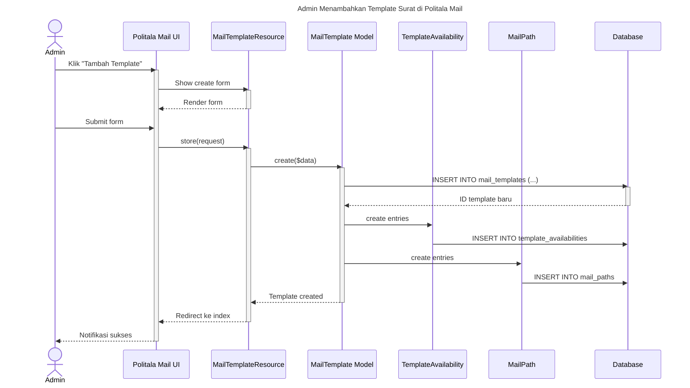

```mermaid

sequenceDiagram
    title Admin Menambahkan Template Surat di Politala Mail

    actor Admin
    participant FilamentUI as Politala Mail UI
    participant MailTemplateResource
    participant MailTemplateModel as MailTemplate Model
    participant TemplateAvailabilityModel as TemplateAvailability
    participant MailPathModel as MailPath
    participant DB as Database

    Admin ->> FilamentUI: Klik "Tambah Template"
    activate FilamentUI
    FilamentUI ->> MailTemplateResource: Show create form
    activate MailTemplateResource
    MailTemplateResource -->> FilamentUI: Render form
    deactivate MailTemplateResource
    Admin ->> FilamentUI: Submit form
    FilamentUI ->> MailTemplateResource: store(request)
    activate MailTemplateResource
    MailTemplateResource ->> MailTemplateModel: create($data)
    activate MailTemplateModel
    MailTemplateModel ->> DB: INSERT INTO mail_templates (...)
    activate DB
    DB -->> MailTemplateModel: ID template baru
    deactivate DB
    MailTemplateModel ->> TemplateAvailabilityModel: create entries
    TemplateAvailabilityModel ->> DB: INSERT INTO template_availabilities
    MailTemplateModel ->> MailPathModel: create entries
    MailPathModel ->> DB: INSERT INTO mail_paths
    MailTemplateModel -->> MailTemplateResource: Template created
    deactivate MailTemplateModel
    MailTemplateResource -->> FilamentUI: Redirect ke index
    deactivate MailTemplateResource
    FilamentUI -->> Admin: Notifikasi sukses
    deactivate FilamentUI


```