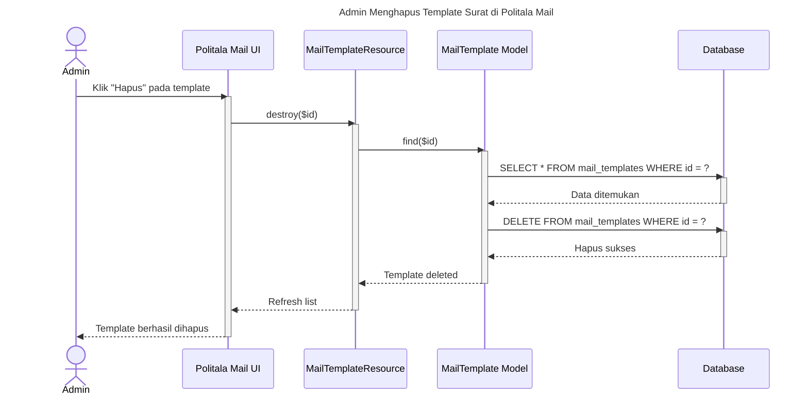

```mermaid
sequenceDiagram
    title Admin Menghapus Template Surat di Politala Mail

    actor Admin
    participant FilamentUI as Politala Mail UI
    participant MailTemplateResource
    participant MailTemplateModel as MailTemplate Model
    participant DB as Database

    Admin ->> FilamentUI: Klik "Hapus" pada template
    activate FilamentUI
    FilamentUI ->> MailTemplateResource: destroy($id)
    activate MailTemplateResource
    MailTemplateResource ->> MailTemplateModel: find($id)
    activate MailTemplateModel
    MailTemplateModel ->> DB: SELECT * FROM mail_templates WHERE id = ?
    activate DB
    DB -->> MailTemplateModel: Data ditemukan
    deactivate DB
    MailTemplateModel ->> DB: DELETE FROM mail_templates WHERE id = ?
    activate DB
    DB -->> MailTemplateModel: Hapus sukses
    deactivate DB
    MailTemplateModel -->> MailTemplateResource: Template deleted
    deactivate MailTemplateModel
    MailTemplateResource -->> FilamentUI: Refresh list
    deactivate MailTemplateResource
    FilamentUI -->> Admin: Template berhasil dihapus
    deactivate FilamentUI


```