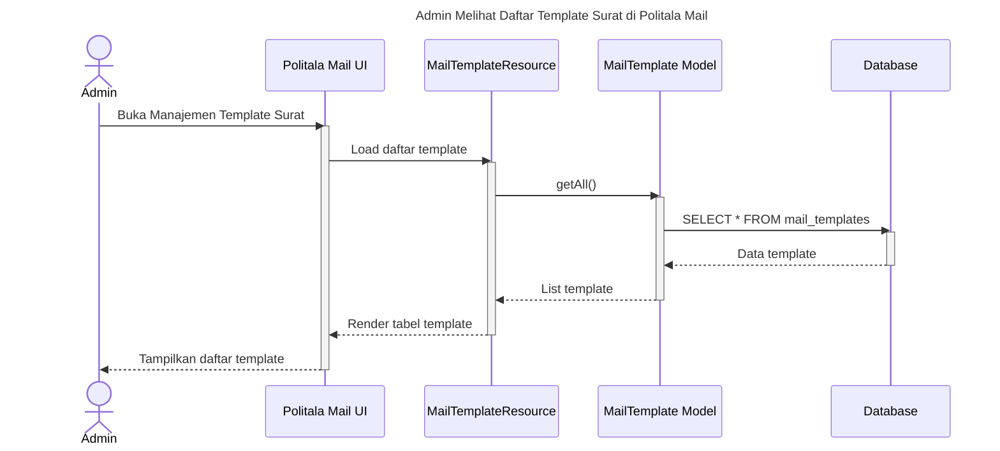

```mermaid
sequenceDiagram
    title Admin Melihat Daftar Template Surat di Politala Mail

    actor Admin
    participant FilamentUI as Politala Mail UI
    participant MailTemplateResource
    participant MailTemplateModel as MailTemplate Model
    participant DB as Database

    Admin ->> FilamentUI: Buka Manajemen Template Surat
    activate FilamentUI
    FilamentUI ->> MailTemplateResource: Load daftar template
    activate MailTemplateResource
    MailTemplateResource ->> MailTemplateModel: getAll()
    activate MailTemplateModel
    MailTemplateModel ->> DB: SELECT * FROM mail_templates
    activate DB
    DB -->> MailTemplateModel: Data template
    deactivate DB
    MailTemplateModel -->> MailTemplateResource: List template
    deactivate MailTemplateModel
    MailTemplateResource -->> FilamentUI: Render tabel template
    deactivate MailTemplateResource
    FilamentUI -->> Admin: Tampilkan daftar template
    deactivate FilamentUI


```