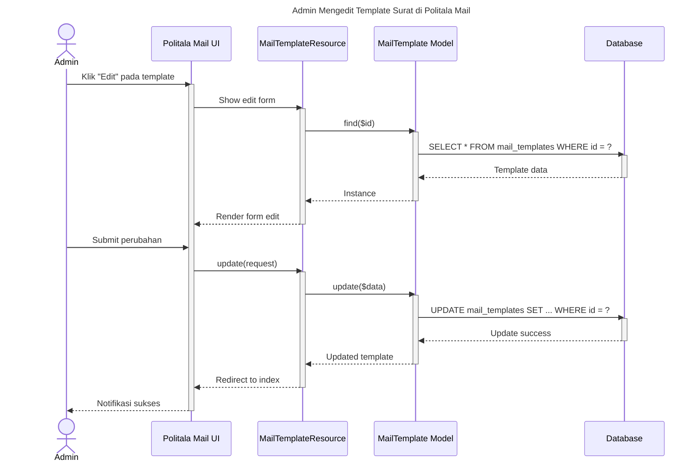

```mermaid

sequenceDiagram
    title Admin Mengedit Template Surat di Politala Mail

    actor Admin
    participant FilamentUI as Politala Mail UI
    participant MailTemplateResource
    participant MailTemplateModel as MailTemplate Model
    participant DB as Database

    Admin ->> FilamentUI: Klik "Edit" pada template
    activate FilamentUI
    FilamentUI ->> MailTemplateResource: Show edit form
    activate MailTemplateResource
    MailTemplateResource ->> MailTemplateModel: find($id)
    activate MailTemplateModel
    MailTemplateModel ->> DB: SELECT * FROM mail_templates WHERE id = ?
    activate DB
    DB -->> MailTemplateModel: Template data
    deactivate DB
    MailTemplateModel -->> MailTemplateResource: Instance
    deactivate MailTemplateModel
    MailTemplateResource -->> FilamentUI: Render form edit
    deactivate MailTemplateResource
    Admin ->> FilamentUI: Submit perubahan
    FilamentUI ->> MailTemplateResource: update(request)
    activate MailTemplateResource
    MailTemplateResource ->> MailTemplateModel: update($data)
    activate MailTemplateModel
    MailTemplateModel ->> DB: UPDATE mail_templates SET ... WHERE id = ?
    activate DB
    DB -->> MailTemplateModel: Update success
    deactivate DB
    MailTemplateModel -->> MailTemplateResource: Updated template
    deactivate MailTemplateModel
    MailTemplateResource -->> FilamentUI: Redirect to index
    deactivate MailTemplateResource
    FilamentUI -->> Admin: Notifikasi sukses
    deactivate FilamentUI


```