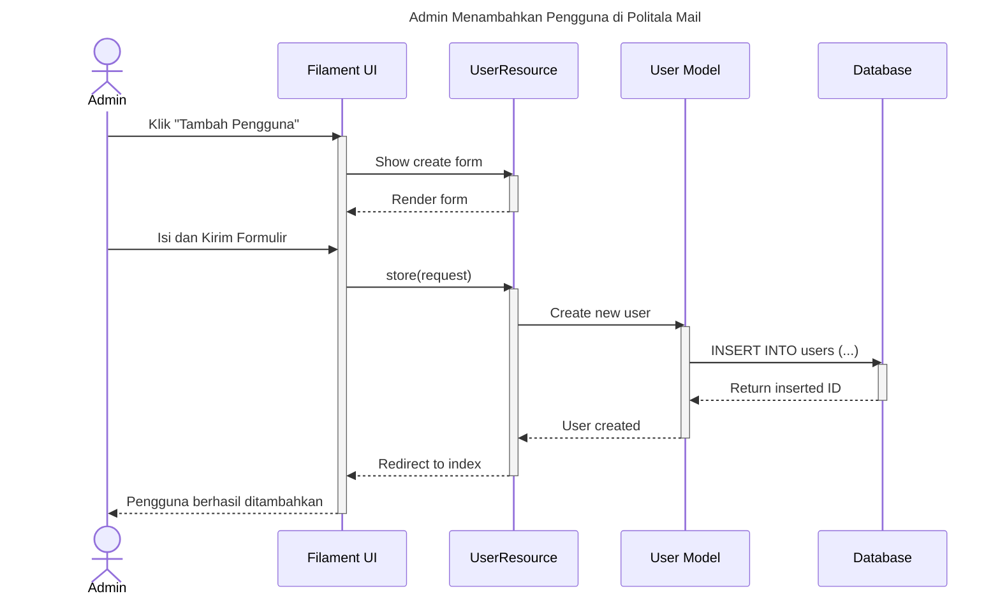

```mermaid

sequenceDiagram
    title Admin Menambahkan Pengguna di Politala Mail

    actor Admin
    participant FilamentUI as Filament UI
    participant UserResource
    participant UserModel as User Model
    participant DB as Database

    Admin ->> FilamentUI: Klik "Tambah Pengguna"
    activate FilamentUI
    FilamentUI ->> UserResource: Show create form
    activate UserResource
    UserResource -->> FilamentUI: Render form
    deactivate UserResource
    Admin ->> FilamentUI: Isi dan Kirim Formulir
    FilamentUI ->> UserResource: store(request)
    activate UserResource
    UserResource ->> UserModel: Create new user
    activate UserModel
    UserModel ->> DB: INSERT INTO users (...)
    activate DB
    DB -->> UserModel: Return inserted ID
    deactivate DB
    UserModel -->> UserResource: User created
    deactivate UserModel
    UserResource -->> FilamentUI: Redirect to index
    deactivate UserResource
    FilamentUI -->> Admin: Pengguna berhasil ditambahkan
    deactivate FilamentUI


``` 