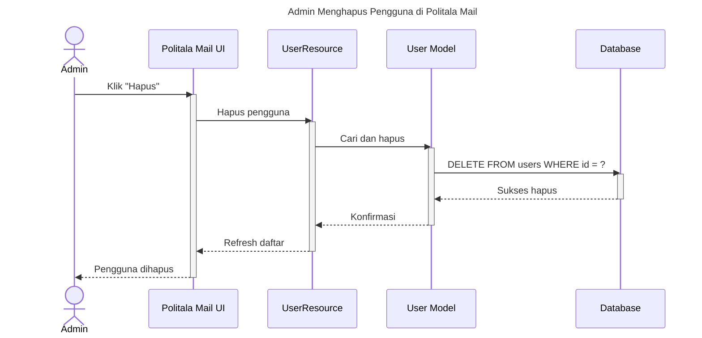

```mermaid

sequenceDiagram
    title Admin Menghapus Pengguna di Politala Mail

    actor Admin
    participant FilamentUI as Politala Mail UI
    participant UserResource
    participant UserModel as User Model
    participant DB as Database

    Admin ->> FilamentUI: Klik "Hapus"
    activate FilamentUI
    FilamentUI ->> UserResource: Hapus pengguna
    activate UserResource
    UserResource ->> UserModel: Cari dan hapus
    activate UserModel
    UserModel ->> DB: DELETE FROM users WHERE id = ?
    activate DB
    DB -->> UserModel: Sukses hapus
    deactivate DB
    UserModel -->> UserResource: Konfirmasi
    deactivate UserModel
    UserResource -->> FilamentUI: Refresh daftar
    deactivate UserResource
    FilamentUI -->> Admin: Pengguna dihapus
    deactivate FilamentUI

```