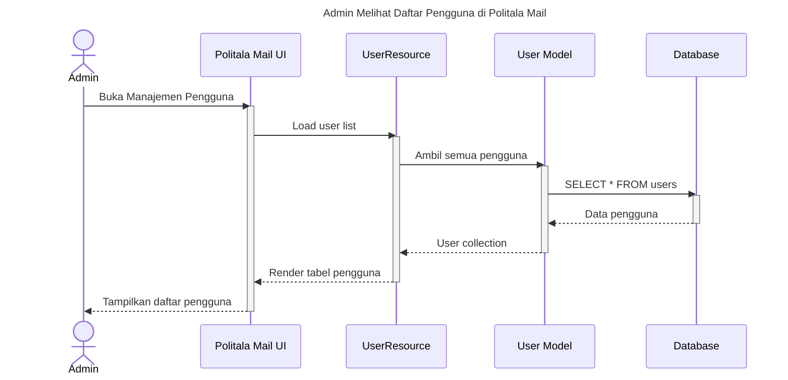

```mermaid

sequenceDiagram
    title Admin Melihat Daftar Pengguna di Politala Mail

    actor Admin
    participant FilamentUI as Politala Mail UI
    participant UserResource
    participant UserModel as User Model
    participant DB as Database

    Admin ->> FilamentUI: Buka Manajemen Pengguna
    activate FilamentUI
    FilamentUI ->> UserResource: Load user list
    activate UserResource
    UserResource ->> UserModel: Ambil semua pengguna
    activate UserModel
    UserModel ->> DB: SELECT * FROM users
    activate DB
    DB -->> UserModel: Data pengguna
    deactivate DB
    UserModel -->> UserResource: User collection
    deactivate UserModel
    UserResource -->> FilamentUI: Render tabel pengguna
    deactivate UserResource
    FilamentUI -->> Admin: Tampilkan daftar pengguna
    deactivate FilamentUI


``` 