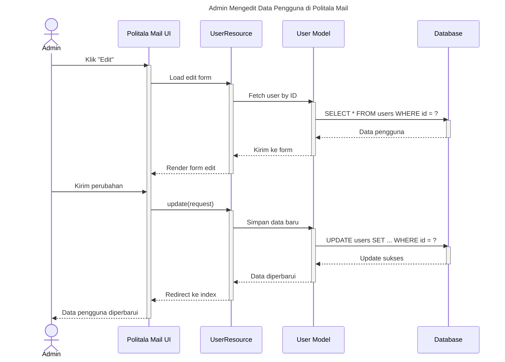

```mermaid
sequenceDiagram
    title Admin Mengedit Data Pengguna di Politala Mail

    actor Admin
    participant FilamentUI as Politala Mail UI
    participant UserResource
    participant UserModel as User Model
    participant DB as Database

    Admin ->> FilamentUI: Klik "Edit"
    activate FilamentUI
    FilamentUI ->> UserResource: Load edit form
    activate UserResource
    UserResource ->> UserModel: Fetch user by ID
    activate UserModel
    UserModel ->> DB: SELECT * FROM users WHERE id = ?
    activate DB
    DB -->> UserModel: Data pengguna
    deactivate DB
    UserModel -->> UserResource: Kirim ke form
    deactivate UserModel
    UserResource -->> FilamentUI: Render form edit
    deactivate UserResource
    Admin ->> FilamentUI: Kirim perubahan
    FilamentUI ->> UserResource: update(request)
    activate UserResource
    UserResource ->> UserModel: Simpan data baru
    activate UserModel
    UserModel ->> DB: UPDATE users SET ... WHERE id = ?
    activate DB
    DB -->> UserModel: Update sukses
    deactivate DB
    UserModel -->> UserResource: Data diperbarui
    deactivate UserModel
    UserResource -->> FilamentUI: Redirect ke index
    deactivate UserResource
    FilamentUI -->> Admin: Data pengguna diperbarui
    deactivate FilamentUI


```