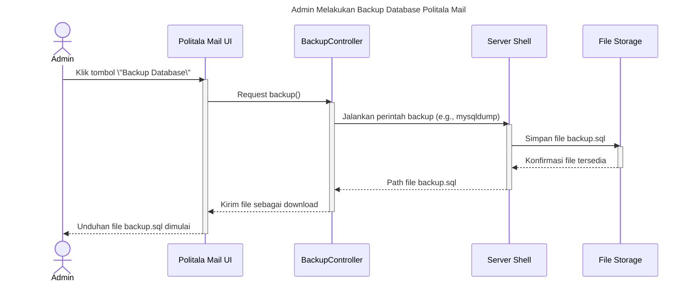

```mermaid

sequenceDiagram
    title Admin Melakukan Backup Database Politala Mail

    actor Admin
    participant WebUI as Politala Mail UI
    participant BackupController
    participant System as Server Shell
    participant Storage as File Storage

    Admin ->> WebUI: Klik tombol \"Backup Database\"
    activate WebUI
    WebUI ->> BackupController: Request backup()
    activate BackupController

    BackupController ->> System: Jalankan perintah backup (e.g., mysqldump)
    activate System
    System ->> Storage: Simpan file backup.sql
    activate Storage
    Storage -->> System: Konfirmasi file tersedia
    deactivate Storage
    System -->> BackupController: Path file backup.sql
    deactivate System

    BackupController -->> WebUI: Kirim file sebagai download
    deactivate BackupController
    WebUI -->> Admin: Unduhan file backup.sql dimulai
    deactivate WebUI


```