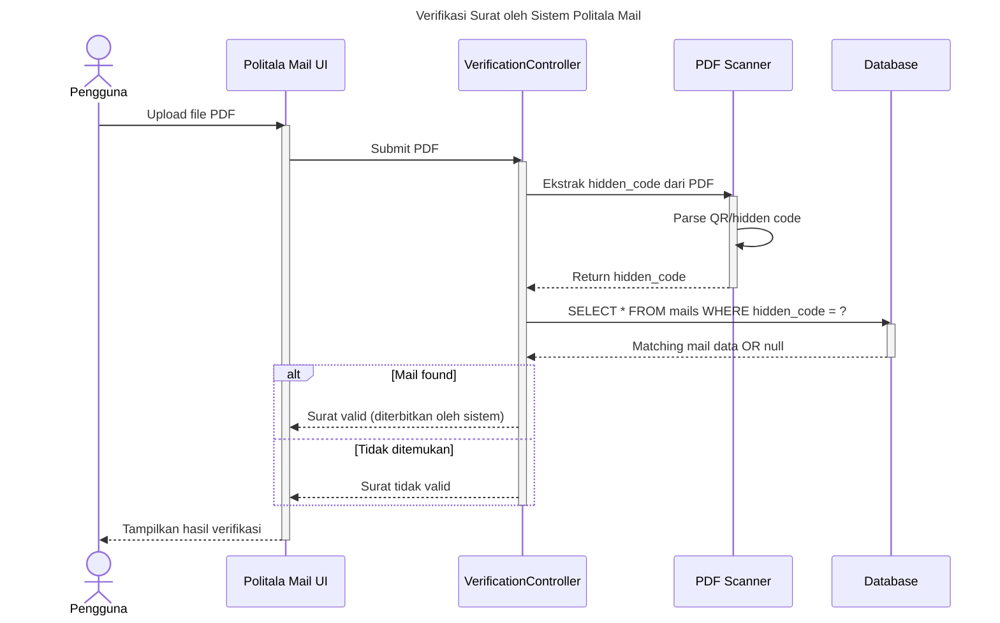

```mermaid

sequenceDiagram
    title Verifikasi Surat oleh Sistem Politala Mail

    actor Pengguna
    participant WebUI as Politala Mail UI
    participant VerificationController
    participant PDFScanner as PDF Scanner
    participant DB as Database

    Pengguna ->> WebUI: Upload file PDF
    activate WebUI
    WebUI ->> VerificationController: Submit PDF
    activate VerificationController

    VerificationController ->> PDFScanner: Ekstrak hidden_code dari PDF
    activate PDFScanner
    PDFScanner ->> PDFScanner: Parse QR/hidden code
    PDFScanner -->> VerificationController: Return hidden_code
    deactivate PDFScanner

    VerificationController ->> DB: SELECT * FROM mails WHERE hidden_code = ?
    activate DB
    DB -->> VerificationController: Matching mail data OR null
    deactivate DB

    alt Mail found
        VerificationController -->> WebUI: Surat valid  (diterbitkan oleh sistem)
    else Tidak ditemukan
        VerificationController -->> WebUI: Surat tidak valid 
    end
    deactivate VerificationController

    WebUI -->> Pengguna: Tampilkan hasil verifikasi
    deactivate WebUI


```