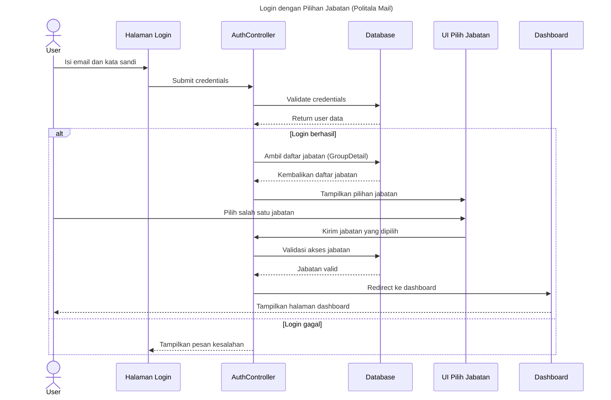

```mermaid


sequenceDiagram
    title Login dengan Pilihan Jabatan (Politala Mail)

    actor Pengguna as User
    participant LoginPage as Halaman Login
    participant AuthController
    participant DB as Database
    participant JabatanUI as UI Pilih Jabatan
    participant Dashboard

    Pengguna ->> LoginPage: Isi email dan kata sandi
    LoginPage ->> AuthController: Submit credentials
    AuthController ->> DB: Validate credentials
    DB -->> AuthController: Return user data
    alt Login berhasil
        AuthController ->> DB: Ambil daftar jabatan (GroupDetail)
        DB -->> AuthController: Kembalikan daftar jabatan
        AuthController ->> JabatanUI: Tampilkan pilihan jabatan
        Pengguna ->> JabatanUI: Pilih salah satu jabatan
        JabatanUI ->> AuthController: Kirim jabatan yang dipilih
        AuthController ->> DB: Validasi akses jabatan
        DB -->> AuthController: Jabatan valid
        AuthController ->> Dashboard: Redirect ke dashboard
        Dashboard -->> Pengguna: Tampilkan halaman dashboard
    else Login gagal
        AuthController -->> LoginPage: Tampilkan pesan kesalahan
    end
```